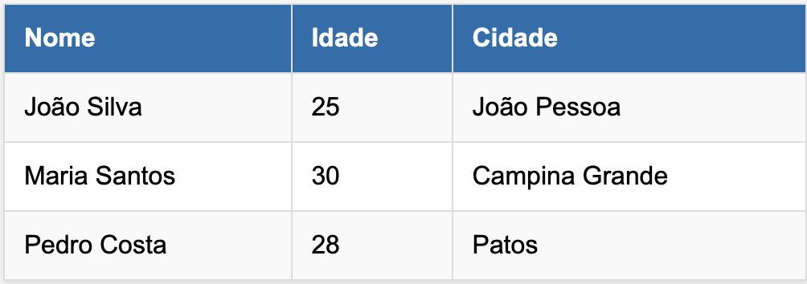
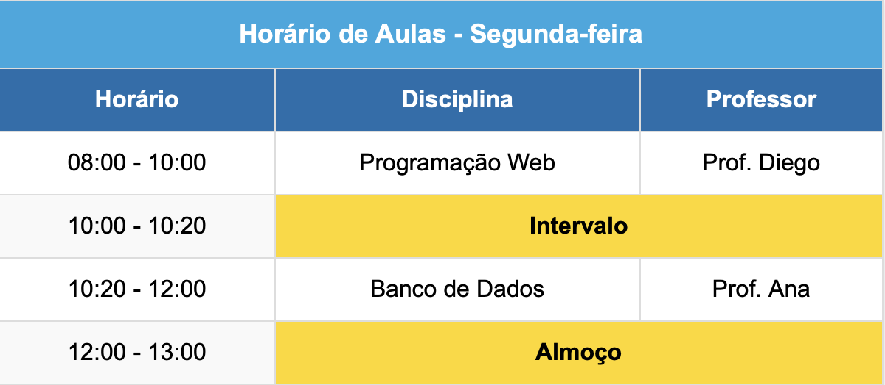
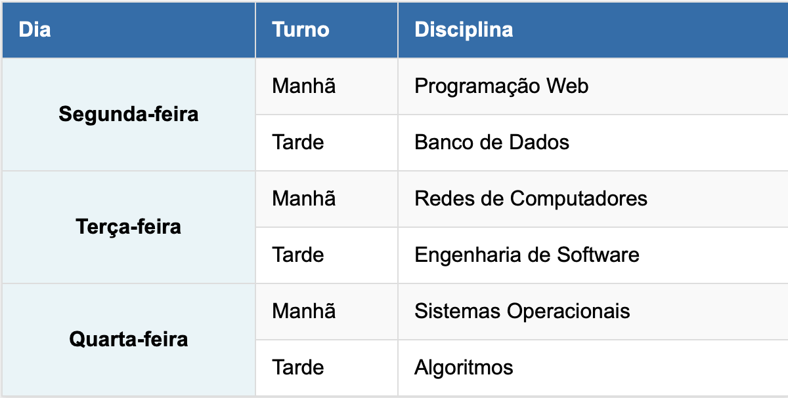
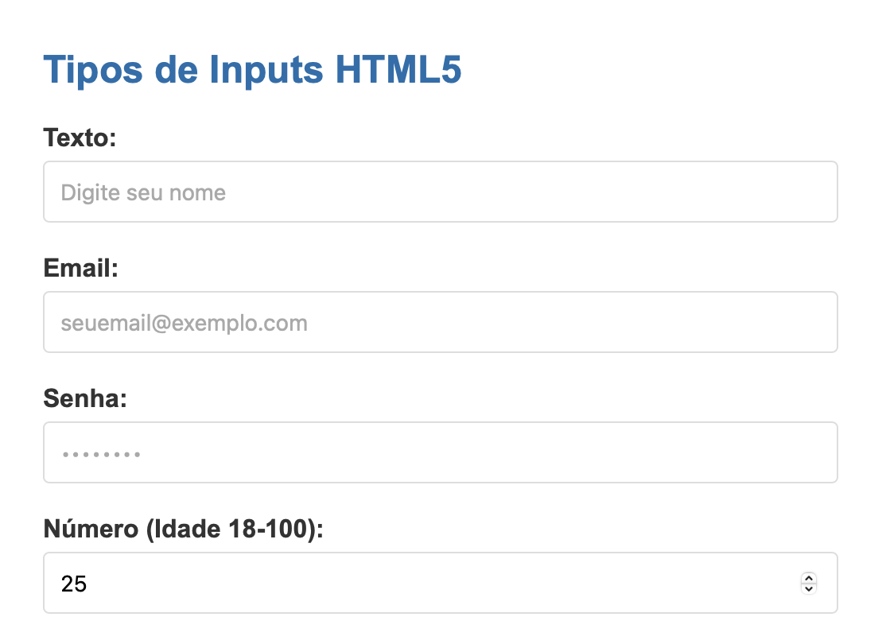
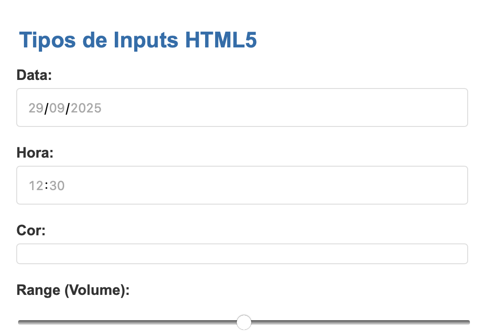
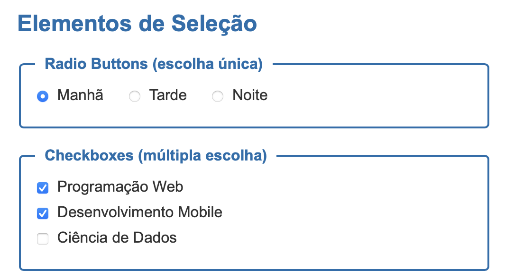
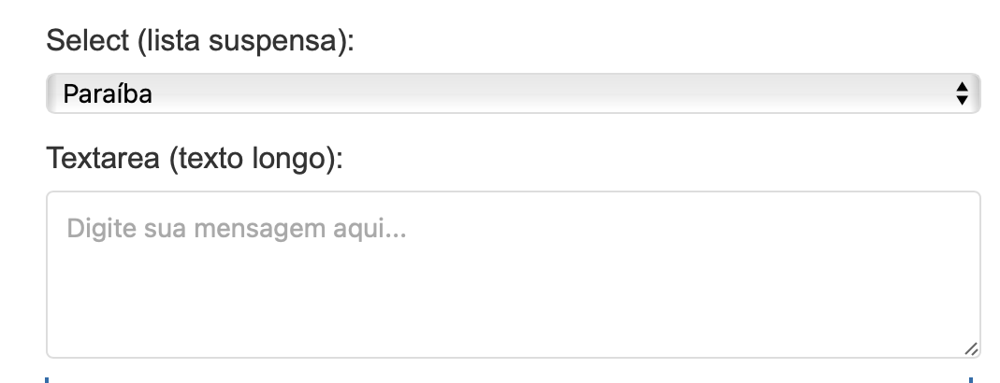

<!-- _class: capa -->
<!-- _paginate: false -->
<!-- _footer: '' -->
<!-- _backgroundImage: url('images/capa.png') -->

# 3. HTML: Tabelas, Formulários e Multimídia
## Programação Web I (2026.2)

### Prof. Diego Pessoa / Prof. Wallennon Dunga

---

# Roteiro

- Tabelas HTML e quando usá-las
- Estrutura semântica com `thead`, `tbody`, `tfoot` e `caption`
- `scope`, `colspan` e `rowspan`
- CSS para tabelas legíveis e responsivas
- Formulários HTML e o elemento `<form>`
- Tipos de `input` e controles de seleção
- Validação HTML5, acessibilidade e UX
- Multimídia nativa: `<video>`, `<audio>` e `<iframe>`
- Exercícios práticos

---

<!-- _header: 'Tabelas HTML' -->

# Por Que Usar Tabelas?

### **Use tabelas para dados tabulares**

<div class="columns">
<div>

### **Quando faz sentido**

- Linhas e colunas com relação clara
- Relatórios, notas, estoque, horários
- Comparações de valores ou métricas
- Calendários e grades

</div>
<div>

### **Quando não usar**

- Layout de página
- Alinhamento visual
- Listas simples
- Cards ou galerias

*Para layout, prefira CSS Grid ou Flexbox (unidade de CSS).*

</div>
</div>

---

# Estrutura Básica de Tabelas

### **Elementos fundamentais**

<div class="columns">
<div>

```html
<table>
  <tr>
    <th>Nome</th>
    <th>Idade</th>
    <th>Cidade</th>
  </tr>
  <tr>
    <td>João Silva</td>
    <td>25</td>
    <td>João Pessoa</td>
  </tr>
</table>
```


</div>
<div>

### **Tags principais**

- `<table>` - tabela
- `<tr>` - linha
- `<th>` - cabeçalho
- `<td>` - célula comum

### **Regra prática**

- Cabeçalhos usam `<th>`
- Dados usam `<td>`
- Evite misturar estrutura com estilo

</div>
</div>

---

# Estrutura Básica: Visualização

### **Exemplo renderizado**



*Código completo em `exemplos/01-tabela-basica.html`.*

---

# Estrutura Semântica: `thead`, `tbody`, `tfoot`
<!-- _footer: '' -->
### **Organizando tabelas maiores**

<div class="columns">
<div>

```html
<table>
  <thead>
    <tr> <th>Produto</th> <th>Qtd</th>
         <th>Preço</th> </tr>
  </thead>
  <tbody>
    <tr> <td>Notebook</td> <td>2</td>
         <td>R$ 3.000</td> </tr>
  </tbody>
  <tfoot>
    <tr> <th colspan="2">Total</th>
         <td>R$ 6.000</td> </tr>
  </tfoot>
</table>
```

</div>
<div>

### **Vantagens**

- Semântica mais clara
- CSS mais previsível
- Melhor impressão
- Melhor navegação assistiva

### **Seções**

- `thead` - cabeçalho
- `tbody` - corpo
- `tfoot` - rodapé

</div>
</div>

---

# `caption` e `scope`

### **Acessibilidade e contexto importam**

<div class="columns">
<div>

```html
<table>
  <caption>Horários da turma 1A</caption>
  <thead>
    <tr>
      <th scope="col">Dia</th>
      <th scope="col">Horário</th>
      <th scope="col">Disciplina</th>
    </tr>
  </thead>
  <tbody>
    <tr>
      <th scope="row">Segunda</th>
      <td>08:00</td> <td>Prog. Web</td>
    </tr>
  </tbody>
</table>
```

</div>
<div>

### **Boas práticas**

- Use `<caption>` para descrever a tabela
- `scope="col"` para cabeçalho de coluna
- `scope="row"` para cabeçalho de linha
- Facilita o trabalho de leitores de tela

### **Extra útil**

- Em tabelas mais complexas, `colgroup` pode ajudar a organizar colunas e estilos

</div>
</div>

---

# `colspan`: Mesclando Colunas

### **Expandindo células na horizontal**

<div class="columns">
<div>

```html
<table>
  <tr>
    <th colspan="3">Horário de Aulas</th>
  </tr>
  <tr>
    <th>Horário</th> <th>Segunda</th>
    <th>Terça</th>
  </tr>
  <tr>
    <td>08:00</td> <td>Prog. Web</td>
    <td>Banco de Dados</td>
  </tr>
  <tr>
    <td colspan="3">Intervalo</td>
  </tr>
</table>
```

</div>
<div>

### **Como funciona**

- `colspan="N"` ocupa `N` colunas
- Útil para títulos e subtotais
- Reduz a quantidade de células na linha
- Exige atenção para manter a grade consistente

</div>
</div>

---

# `colspan`: Visualização



*O `colspan` une células horizontalmente (`exemplos/03-tabela-colspan.html`).*

---

# `rowspan`: Mesclando Linhas

### **Expandindo células na vertical**

<div class="columns">
<div>

```html
<table>
  <tr>
    <th>Dia</th>
    <th>Turno</th>
    <th>Disciplina</th>
  </tr>
  <tr>
    <td rowspan="2">Segunda</td>
    <td>Manhã</td>
    <td>Programação Web</td>
  </tr>
  <tr>
    <td>Tarde</td>
    <td>Banco de Dados</td>
  </tr>
</table>
```

</div>
<div>

### **Como funciona**

- `rowspan="N"` ocupa `N` linhas
- Agrupa categorias repetidas
- Bom para horários e agrupamentos
- Planeje a tabela antes de escrever o HTML

</div>
</div>

---

# `rowspan`: Visualização



*O `rowspan` une células verticalmente (`exemplos/04-tabela-rowspan.html`).*

---

# Estilizando Tabelas com CSS

### **Apresentação moderna e legível (spoiler da próxima unidade)**

<div class="columns">
<div>

```css
table {
  width: 100%;
  border-collapse: collapse;
}

th, td {
  padding: 12px;
  text-align: left;
  border-bottom: 1px solid #ddd;
}

thead th {
  background: #186fad;
  color: white;
}

tbody tr:nth-child(even) {
  background: #f7fbfe;
}
```

</div>
<div>

### **Propriedades importantes**

- `border-collapse`
- `padding`
- `text-align`
- `:hover`
- `:nth-child()`

### **Evite**

- `border`, `cellpadding`, `cellspacing`
- atributos visuais antigos no HTML

</div>
</div>

---

# Tabelas Responsivas

### **Mobile primeiro: nem toda tabela cabe na tela**

<div class="columns">
<div>

```html
<div class="tabela-wrapper">
  <table>
    <thead>
      <tr>
        <th>Produto</th>
        <th>Descrição</th>
        <th>Preço</th>
        <th>Estoque</th>
      </tr>
    </thead>
  </table>
</div>
```

```css
.tabela-wrapper {
  overflow-x: auto;
}
```

</div>
<div>

### **Estratégias**

- Scroll horizontal controlado
- Priorizar colunas essenciais
- Esconder colunas secundárias com CSS
- Trocar por cards em telas pequenas, se necessário

### **Observação atual**

- Tabelas continuam úteis no mobile, mas o layout precisa ser pensado

</div>
</div>

---

<!-- _header: 'Formulários HTML' -->

# Introdução aos Formulários

### **Ponto de entrada dos dados do usuário**

<div class="columns">
<div>

### **Usos comuns**

- Login e cadastro
- Busca e filtros
- Checkout
- Comentários e feedback
- Upload de arquivos

</div>
<div>

### **Elementos principais**

- `<form>` - agrupa os campos
- `<input>` - entrada de dados
- `<label>` - rótulo associado
- `<button>` - ação do usuário

</div>
</div>

---

# Estrutura Básica de um Formulário

### **O elemento `<form>`**

<div class="columns">
<div>

```html
<form action="/processar" method="post">
  <label for="nome">Nome:</label>
  <input type="text" id="nome"
         name="nome" required>

  <label for="email">Email:</label>
  <input type="email" id="email"
         name="email" required>

  <button type="submit">Enviar</button>
</form>
```

</div>
<div>

### **Atributos do form**

- `action` - URL de destino
- `method` - `get` ou `post`
- `enctype` - codificação dos dados
- `autocomplete` - liga/desliga sugestões

### **HTTP**

- `GET` envia na URL
- `POST` envia no corpo

*Veremos o lado servidor na unidade de Flask.*

</div>
</div>

---

# Textos, Senhas, Email, URL e Telefone

### **Use tipos específicos**

<div class="columns">
<div>

```html
<input type="text"
       name="nome"
       placeholder="Digite seu nome">

<input type="password"
       name="senha"
       minlength="8">

<input type="email"
       name="email"
       placeholder="email@exemplo.com">

<input type="url"
       name="site"
       placeholder="https://exemplo.com">

<input type="tel"
       name="telefone"
       pattern="[0-9]{11}">
```

</div>
<div>

### **Ganhos**

- Validação nativa
- Melhor teclado no celular
- Semântica mais clara
- UX melhor com pouco esforço

### **Tipos úteis**

- `text`, `password`, `email`
- `url`, `tel`, `search`

</div>
</div>

---

# Números, Datas e Range

### **Controles especializados do HTML5**

<div class="columns">
<div>

```html
<input type="number" name="idade"
       min="18" max="100">

<input type="date" name="nascimento">

<input type="time" name="horario">

<input type="datetime-local"
       name="agendamento">

<input type="range" name="volume"
       min="0" max="100" value="50">
```

</div>
<div>

### **Vantagens**

- Controles nativos do navegador
- Menos JavaScript para casos simples
- Melhor experiência em dispositivos móveis

### **Outros tipos**

- `month`
- `week`
- `color`

</div>
</div>

---

# Tipos de Input: Visualização



*Os navegadores renderizam controles diferentes conforme o tipo (`exemplos/05-formulario-inputs.html`).*

---

# Tipos de Input: Mais Exemplos



*Vale testar em mais de um navegador e também no celular.*

---

# Checkbox e Radio Button

### **Uma opção ou várias opções**

<div class="columns">
<div>

```html
<fieldset>
  <legend>Turno</legend>
  <label>
    <input type="radio" name="turno"
           value="manha">
    Manhã
  </label>
  <label>
    <input type="radio" name="turno"
           value="tarde">
    Tarde
  </label>
</fieldset>

<label>
  <input type="checkbox" name="interesse"
         value="web">
  Programação Web
</label>
```

</div>
<div>

### **Diferenças**

- `radio` usa o mesmo `name`
- `checkbox` permite múltiplas escolhas

### **Boas práticas**

- Agrupe com `<fieldset>`
- Use `<legend>` descritivo
- Torne a `label` clicável

</div>
</div>

---

# Elementos de Seleção: Visualização
<!-- _footer: '' -->



*Exemplo com `fieldset`, radios e checkboxes (`exemplos/06-formulario-selecao.html`).*

---

# `select` e `textarea`

### **Listas e texto longo**

<div class="columns">
<div>

```html
<label for="estado">Estado:</label>
<select id="estado" name="estado">
  <option value="PB">Paraíba</option>
  <option value="PE">Pernambuco</option>
</select>

<select name="disciplinas"
        multiple size="3">
  <option value="pweb">Prog. Web</option>
  <option value="bd">Banco de Dados</option>
  <option value="poo">POO</option>
</select>

<textarea name="mensagem"
          rows="4" cols="40"></textarea>
```

</div>
<div>

### **Quando usar**

- `select` para lista finita
- `multiple` para várias escolhas
- `textarea` para textos maiores

### **Dica**

- Use `maxlength` e instruções curtas para orientar o usuário

</div>
</div>

---

# `select` e `textarea`: Visualização



*Controles de seleção e texto multilinha renderizados.*

---

# Upload de Arquivos

### **Envio de arquivos exige atenção**

<div class="columns">
<div>

```html
<form action="/upload"
      method="post"
      enctype="multipart/form-data">

  <input type="file"
         name="arquivo"
         accept=".pdf,.doc,.docx">

  <input type="file"
         name="fotos"
         accept="image/*"
         multiple>

  <button type="submit">Enviar</button>
</form>
```

</div>
<div>

### **Atributos importantes**

- `enctype="multipart/form-data"`
- `accept`
- `multiple`

### **Segurança**

- Validar tipo e tamanho no servidor
- Nunca confiar só no `accept`

</div>
</div>

---

# Validação HTML5

### **Primeira barreira de qualidade**

<div class="columns">
<div>

```html
<input type="text" name="nome" required>

<input type="password" name="senha"
       minlength="8" maxlength="20">

<input type="text" name="cep"
       pattern="[0-9]{5}-[0-9]{3}">

<input type="number" name="idade"
       min="18" max="100">
```

</div>
<div>

### **Atributos úteis**

- `required`
- `minlength` / `maxlength`
- `min` / `max`
- `pattern`
- `step`

### **Regra séria**

- Sempre valide no servidor também

</div>
</div>

---

# Labels, Fieldsets e Acessibilidade

### **Todo campo precisa de contexto**

<div class="columns">
<div>

```html
<label for="email">Email:</label>
<input type="email" id="email" name="email">

<label>
  Nome:
  <input type="text" name="nome">
</label>

<fieldset>
  <legend>Dados pessoais</legend>
  <label for="cpf">CPF:</label>
  <input type="text" id="cpf" name="cpf">
</fieldset>
```

</div>
<div>

### **Benefícios**

- Melhor usabilidade
- Navegação por leitor de tela
- Área de clique maior
- Formulário mais compreensível

### **Regras**

- Não use placeholder como label
- Associe `for` com `id`
- Agrupe blocos relacionados

</div>
</div>

---

# Atributos Mais Modernos

### **UX melhor sem exagerar no JavaScript**

<div class="columns">
<div>

```html
<input type="text" name="nome"
       autocomplete="name">

<input type="email" name="email"
       autocomplete="email">

<input type="text" name="cep"
       inputmode="numeric"
       enterkeyhint="next">

<input type="text" name="cidade"
       list="cidades">
<datalist id="cidades">
  <option value="João Pessoa">
  <option value="Campina Grande">
</datalist>
```

</div>
<div>

### **Por que usar**

- `autocomplete` acelera preenchimento
- `inputmode` melhora o teclado mobile
- `enterkeyhint` sugere ação ao usuário
- `datalist` oferece sugestões rápidas

### **Complemento útil**

- `aria-describedby` pode ligar o campo a um texto de ajuda ou erro

</div>
</div>

---

# Botões e Ações

### **Nem todo botão faz a mesma coisa**

<div class="columns">
<div>

```html
<button type="submit">Enviar</button>

<input type="submit" value="Cadastrar">

<button type="reset">Limpar</button>

<button type="button">Validar</button>

<button type="submit" disabled>
  Processando...
</button>
```

</div>
<div>

### **Tipos**

- `submit` envia
- `reset` limpa
- `button` não faz nada sozinho

### **Recomendação**

- Prefira `<button>`
- Declare o `type` explicitamente

</div>
</div>

---

<!-- _header: 'Multimídia' -->

# Multimídia Nativa no HTML5

### **Antes: plugins (Flash). Hoje: tags nativas.**

<div class="columns">
<div>

### **As tags**

- `<video>` - vídeo com controles nativos
- `<audio>` - áudio com controles nativos
- `<source>` - formatos alternativos
- `<track>` - legendas e transcrições
- `<iframe>` - conteúdo externo (YouTube etc.)

</div>
<div>

### **Por que importa**

- Sem plugins ou bibliotecas
- Controles e atalhos do navegador
- Acessibilidade integrada (legendas)
- Funciona em qualquer dispositivo

</div>
</div>

---

# O Elemento `<video>`

### **Vídeo direto no HTML**

<div class="columns">
<div>

```html
<video controls width="640"
       poster="capa-video.jpg"
       preload="metadata">
  <source src="aula.mp4"
          type="video/mp4">
  <source src="aula.webm"
          type="video/webm">
  Seu navegador não suporta vídeo.
  <a href="aula.mp4">Baixe o vídeo</a>.
</video>
```

</div>
<div>

### **Atributos principais**

- `controls` - exibe controles nativos
- `poster` - imagem de capa
- `preload` - `none`, `metadata`, `auto`
- `width` / `height` - dimensões

### **Fallback**

- `<source>` em ordem de preferência
- Texto interno aparece se nada funcionar

</div>
</div>

---

# `<video>`: Autoplay e Vídeo de Fundo

### **Autoplay tem regras**

<div class="columns">
<div>

```html
<video autoplay muted loop playsinline>
  <source src="fundo.webm"
          type="video/webm">
</video>
```

</div>
<div>

### **Regras dos navegadores**

- `autoplay` **só funciona com `muted`**
- Evita páginas "gritando" ao abrir
- `loop` reinicia automaticamente
- `playsinline` evita fullscreen no iOS

### **Use com moderação**

- Consome banda e bateria
- Pode distrair e atrapalhar a leitura

</div>
</div>

---

# O Elemento `<audio>`

### **Mesma lógica do vídeo**

<div class="columns">
<div>

```html
<audio controls preload="none">
  <source src="podcast.mp3"
          type="audio/mpeg">
  <source src="podcast.ogg"
          type="audio/ogg">
  Seu navegador não suporta áudio.
</audio>
```

</div>
<div>

### **Atributos**

- `controls`, `loop`, `muted`, `preload`
- Sem `controls`, o player fica invisível

### **Formatos comuns**

- MP3 (`audio/mpeg`) - suporte universal
- OGG e AAC como alternativas

### **Usos**

- Podcasts, música, efeitos, pronúncia

</div>
</div>

---

# Legendas com `<track>`

### **Multimídia acessível**

<div class="columns">
<div>

```html
<video controls>
  <source src="aula.mp4"
          type="video/mp4">
  <track kind="subtitles"
         src="legendas-pt.vtt"
         srclang="pt"
         label="Português"
         default>
</video>
```

```
WEBVTT

00:00:01.000 --> 00:00:04.000
Bem-vindos à aula de HTML!
```

</div>
<div>

### **Como funciona**

- Arquivo `.vtt` (WebVTT) com os tempos
- `kind` - `subtitles`, `captions`, `descriptions`
- `default` ativa a faixa automaticamente

### **Por que usar**

- Pessoas com deficiência auditiva
- Quem assiste sem som
- Indexação do conteúdo

</div>
</div>

---

# Incorporando Conteúdo com `<iframe>`

### **YouTube, mapas e outros serviços**

<div class="columns">
<div>

```html
<iframe width="560" height="315"
  src="https://www.youtube.com/embed/ID"
  title="Título descritivo do vídeo"
  allow="encrypted-media;
         picture-in-picture"
  allowfullscreen>
</iframe>
```

</div>
<div>

### **Quando usar**

- Vídeo já hospedado (YouTube, Vimeo)
- Mapas (Google Maps, OpenStreetMap)
- Serviços fornecem o código pronto (botão *Compartilhar → Incorporar*)

### **Atenção**

- Sempre preencha o `title` (acessibilidade)
- Hospedar vídeo é caro: use serviços

</div>
</div>

---

# Multimídia: Boas Práticas

<div class="columns">
<div>

### **Desempenho**

- `preload="none"` ou `"metadata"` para não baixar tudo
- Comprima os arquivos (vídeo pesa!)
- Prefira serviços de streaming para vídeos longos

</div>
<div>

### **Acessibilidade e UX**

- Sempre ofereça `controls` (exceto vídeo de fundo)
- Legendas com `<track>` sempre que possível
- Nunca autoplay com som
- Fallback com link para download

</div>
</div>

*Demonstração completa em `exemplos/07-video-audio.html`.*

---

<!-- _header: 'Exemplo Prático' -->
<!-- _footer: '' -->

# Exemplo Completo: Formulário de Cadastro

```html
<form action="/cadastro" method="post" autocomplete="on">
  <fieldset>
    <legend>Dados pessoais</legend>

    <label for="nome">Nome completo *</label>
    <input type="text" id="nome" name="nome"
           autocomplete="name" required>

    <label for="email">Email *</label>
    <input type="email" id="email" name="email"
           autocomplete="email" required>

    <label for="nascimento">Data de nascimento</label>
    <input type="date" id="nascimento"
           name="nascimento">
  </fieldset>
```

---

<!-- _footer: '' -->

# Exemplo Completo: Formulário de Cadastro

```html
  <fieldset>
    <legend>Interesses</legend>

    <label><input type="checkbox" name="int"
           value="web"> Web</label>
    <label><input type="checkbox" name="int"
           value="mobile"> Mobile</label>
  </fieldset>

  <label for="bio">Sobre você</label>
  <textarea id="bio" name="bio" rows="3"></textarea>

  <label for="foto">Foto</label>
  <input type="file" id="foto" name="foto"
         accept="image/*">

  <button type="submit">Cadastrar</button>
</form>
```

---

<!-- _header: 'Exercícios Práticos' -->

# Exercício 1: Tabela de Horários

### **Monte uma tabela acadêmica completa**

<div class="columns">
<div>

### **Requisitos**

- Dias da semana de segunda a sexta
- Pelo menos 4 horários
- `caption`, `thead` e `tbody`
- Cabeçalhos com `scope`
- `colspan` para intervalos

</div>
<div>

### **Desafio extra**

- Use `rowspan` quando fizer sentido
- Adicione `tfoot` com carga horária
- Deixe a tabela responsiva com scroll horizontal

*Enunciado completo em `pratica/ex1-tabela-horarios/`.*

</div>
</div>

---

# Exercício 2: Formulário de Inscrição

### **Crie a página de inscrição de um evento**

<div class="columns">
<div>

### **Campos**

- Nome completo, email, telefone
- Data de nascimento
- Tipo de ingresso e quantidade
- Interesses
- Comentários

</div>
<div>

### **Requisitos técnicos**

- `fieldset` e `legend`
- `label` em todos os campos
- Validação HTML5
- Vídeo de divulgação do evento (`<video>` ou `<iframe>`)
- Botões de `submit` e `reset`

*Enunciado completo em `pratica/ex2-formulario-inscricao/`.*

</div>
</div>

---

<!-- _header: 'Boas Práticas' -->

# Boas Práticas em Tabelas

<div class="columns">
<div>

### **Estrutura e semântica**

- Use `thead`, `tbody`, `tfoot`
- Prefira `<th>` a células "decorativas"
- Use `scope` e `caption`
- Evite tabelas aninhadas

</div>
<div>

### **Responsividade e leitura**

- Use CSS, não atributos antigos
- Garanta contraste suficiente
- Teste em telas pequenas
- Simplifique quando a tabela ficar grande demais

</div>
</div>

---

# Boas Práticas em Formulários

<div class="columns">
<div>

### **Estrutura**

- Labels em todos os campos
- Ordem lógica de preenchimento
- `fieldset` para grupos
- Campos obrigatórios bem indicados

</div>
<div>

### **UX, acessibilidade e segurança**

- Tipos corretos de `input`
- `autocomplete` quando apropriado
- Mensagens de erro claras
- HTTPS e validação no servidor

</div>
</div>

---

<!-- _header: 'Conclusão' -->

# Resumo da Aula

### **O que aprendemos hoje?**

<div class="columns-3">
<div>

### **Tabelas**

- Estrutura básica
- Seções semânticas
- `scope`, `caption`, `colspan`, `rowspan`

</div>
<div>

### **Formulários**

- Estrutura com `<form>`
- Tipos de `input`
- Validação HTML5
- Acessibilidade

</div>
<div>

### **Multimídia**

- `<video>` e `<audio>`
- `<source>` e `<track>`
- `<iframe>` para embeds

</div>
</div>

---

# Recursos para Continuar Aprendendo

<div class="columns">
<div>

### **Referência oficial**

- **[MDN: Tabelas HTML](https://developer.mozilla.org/pt-BR/docs/Learn_web_development/Core/Structuring_content/HTML_table_basics)**
- **[MDN: Formulários HTML](https://developer.mozilla.org/pt-BR/docs/Learn_web_development/Extensions/Forms)**
- **[MDN: Vídeo e Áudio](https://developer.mozilla.org/pt-BR/docs/Learn_web_development/Core/Structuring_content/HTML_video_and_audio)**
- **[HTML Living Standard](https://html.spec.whatwg.org/)**

</div>
<div>

### **Ferramentas e validação**

- **[W3C Markup Validator](https://validator.w3.org/)**
- **[HTML5 Validator](https://html5.validator.nu/)**
- **[WCAG Quick Reference](https://www.w3.org/WAI/WCAG22/quickref/)**

</div>
</div>

---

<!-- _class: lead -->

# Obrigado!

## **Perguntas?**

*"Tabelas, formulários e multimídia parecem básicos, mas são parte central da web semântica, acessível e usável."*
